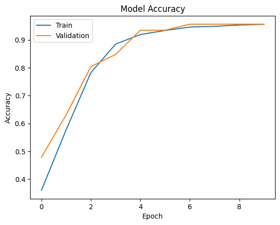

# 🩺 Breast Cancer Classification

## 📋 Features

- **Dataset**: Breast Cancer Dataset from Scikit-learn with 569 samples and 30 features.
- **Techniques Used**:
  - Logistic Regression for quick and interpretable classification.
  - Neural Networks for improved accuracy and performance.
- **Data Preprocessing**:
  - Standardization of features.
  - Removal of unnecessary columns.
  - Handling class imbalance.
- **Visualizations**:
  - Feature distributions.
  - Correlation matrix to identify relationships between features.
  - Outlier detection using box plots.
- **Performance**:
  - Logistic Regression:
    - Training Accuracy: `94.7%`
    - Test Accuracy: `95.6%`
  - Neural Network:
    - Training Accuracy: `96.6%`
    - Test Accuracy: `95.6%`
  - Neural network performance improves with each epoch, reducing loss and increasing accuracy.
 
  

**Web Application (Streamlit):**  
This project also features a Streamlit-based web app, where users can input values to predict whether a tumor is benign or malignant. The web app provides an easy interface to interact with the model.

📊 **Project Workflow**  
- **Data Loading:** Data collected from the Scikit-learn Breast Cancer dataset.  
  - Includes 30 features describing tumor characteristics.  
- **Exploratory Data Analysis:** Summary statistics, feature distributions, and correlation analysis.  
- **Preprocessing:**  
  - Standardization for neural network training.  
  - Outlier detection and handling.  
- **Model Training:**  
  - Logistic Regression for baseline performance.  
  - Neural Networks for advanced performance.  
- **Prediction System:**  
  - Predict whether a patient’s condition is benign or malignant based on input features.  
  - Streamlit app allows users to easily interact with the model and get predictions.

---

## 🤝 Contributions

Contributions are welcome! Please fork the repository, make your changes, and submit a pull request.
